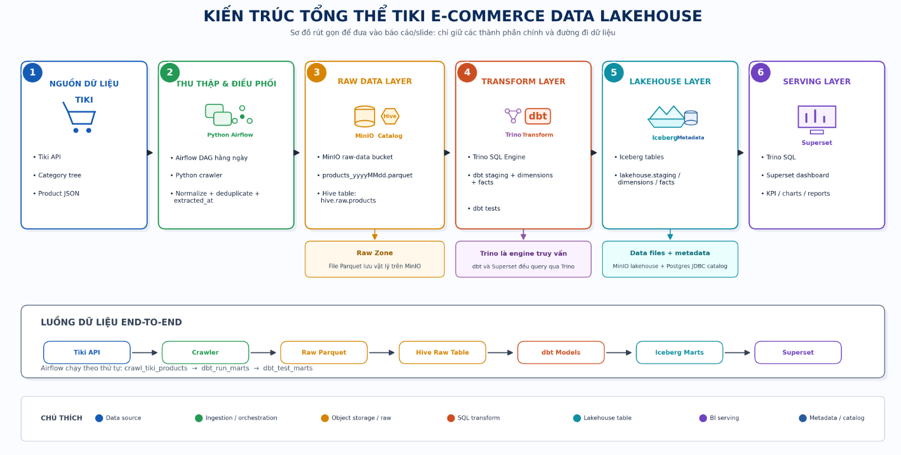
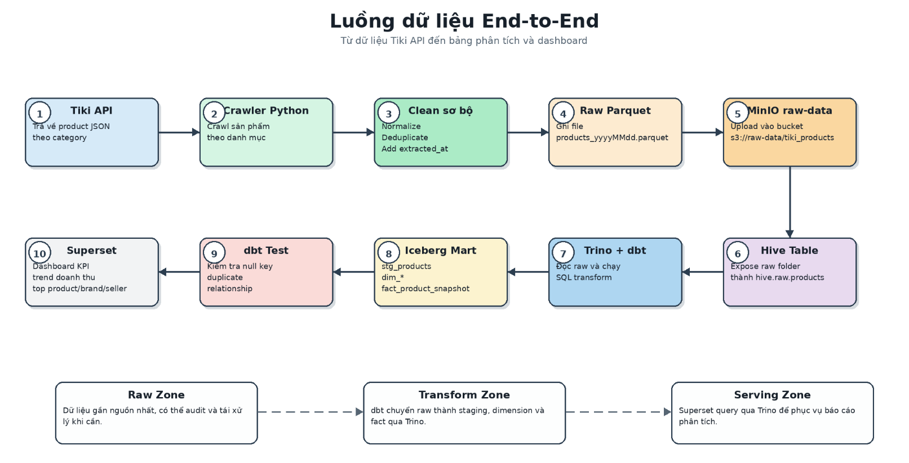
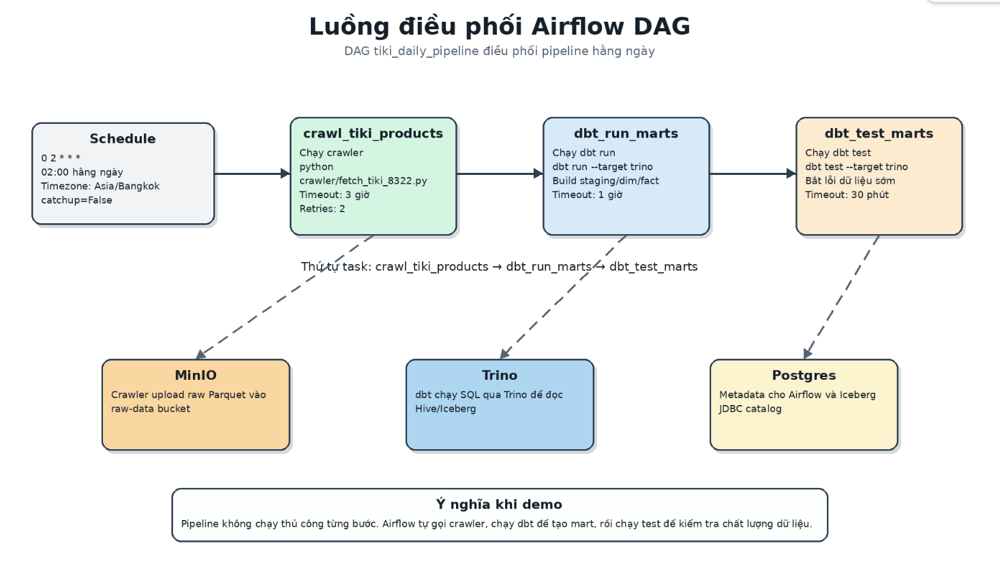
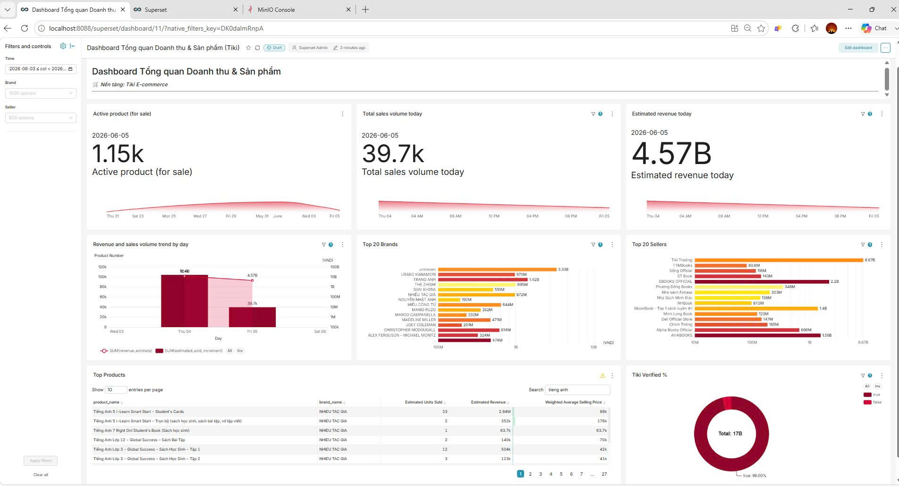

# Tiki Lakehouse Analytics Project

Dự án xây dựng pipeline dữ liệu end-to-end cho dữ liệu sản phẩm Tiki. Pipeline crawl dữ liệu sản phẩm hằng ngày, lưu raw data vào MinIO, expose raw Parquet bằng Hive catalog, transform bằng dbt qua Trino, lưu bảng phân tích vào Iceberg, điều phối bằng Airflow và trực quan hóa bằng Apache Superset.

Mục tiêu chính:

- Theo dõi số lượng bán ước tính theo ngày.
- Theo dõi doanh thu ước tính theo ngày.
- Phân tích top sản phẩm, brand, seller, category.
- Quan sát biến động bán hàng dựa trên snapshot sản phẩm hằng ngày.
- Tạo một lakehouse local để học và demo Data Engineering.

## 1. Kiến Trúc Tổng Quan



### Vai Trò Các Thành Phần

| Thành phần | Vai trò trong hệ thống |
|---|---|
| Python crawler | Gọi Tiki API, crawl sản phẩm theo category, deduplicate và ghi Parquet |
| MinIO | Object storage S3-compatible, lưu raw files và Iceberg data files |
| Hive catalog | Giúp Trino đọc folder raw Parquet như một SQL table `hive.raw.products` |
| Trino | SQL query engine cho dbt và Superset |
| Iceberg | Table format cho staging, dimensions, facts trong lakehouse |
| Postgres | Lưu metadata cho Superset và Iceberg JDBC catalog |
| dbt | Transform raw data thành staging, dimensions và fact |
| Airflow | Orchestrate pipeline hằng ngày và chạy dbt tests |
| Superset | BI/dashboard layer query dữ liệu qua Trino |

Tóm tắt ngắn gọn:

```text
Hive = cửa đọc raw Parquet.
Iceberg = nơi quản lý bảng staging/dim/fact đã transform.
Trino = engine chạy SQL trên Hive và Iceberg.
MinIO = nơi lưu file vật lý.
```

## 2. Luồng Dữ Liệu End-to-End



Chi tiết luồng:

1. `crawler/fetch_tiki_8322.py` crawl sản phẩm từ Tiki API.
2. Crawler ghi file:

```text
s3://raw-data/tiki_products/products_yyyyMMdd.parquet
```

3. Trino Hive catalog expose raw folder thành table:

```text
hive.raw.products
```

4. dbt staging đọc raw table:

```sql
FROM hive.raw.products
```

5. dbt ghi staging, dimensions và facts vào Iceberg:

```text
lakehouse.staging.stg_products
lakehouse.dimensions.*
lakehouse.facts.fact_product_snapshot
```

6. Superset query các bảng lakehouse qua Trino.

## 3. Docker Services

| Service | Container | URL/Port | Mục đích |
|---|---|---|---|
| MinIO | `tiki_minio` | http://localhost:9001 | Object storage UI |
| Trino | `tiki_trino` | http://localhost:8080 | SQL query engine |
| Airflow | `tiki_airflow_webserver` | http://localhost:8081 | Orchestration UI |
| Superset | `tiki_superset` | http://localhost:8088 | Dashboard UI |
| Postgres | `tiki_postgres` | localhost:5432 | Superset DB và Iceberg metadata |
| Postgres Airflow | `tiki_postgres_airflow` | localhost:5433 | Airflow metadata DB |

Timezone runtime được cấu hình là:

```text
Asia/Bangkok
```

Các container Airflow và Trino được set `TZ=Asia/Bangkok`. Trino JVM cũng được set:

```text
-Duser.timezone=Asia/Bangkok
```

## 4. Airflow DAG

DAG chính:

```text
tiki_daily_pipeline
```



Lịch chạy:

```text
02:00 hằng ngày theo Asia/Bangkok
```

Thứ tự task hiện tại:

```text
crawl_tiki_products
    -> dbt_run_marts
    -> dbt_test_marts
```

Ý nghĩa:

| Task | Chức năng |
|---|---|
| `crawl_tiki_products` | Crawl sản phẩm Tiki và upload raw Parquet vào MinIO |
| `dbt_run_marts` | Build staging, dimensions và facts |
| `dbt_test_marts` | Chạy dbt tests sau khi build xong |

`dbt_test_marts` giúp pipeline fail sớm nếu có lỗi chất lượng dữ liệu như null key, duplicate key hoặc relationship sai giữa fact và dimension.

## 5. Data Model


### Grain Của Fact

Bảng `lakehouse.facts.fact_product_snapshot` có grain:

```text
1 dòng = 1 sản phẩm tại 1 ngày/thời điểm crawl
```

Khóa logic:

```text
snapshot_id = HASH(product_id || extracted_at)
```

### Metric Quan Trọng

`quantity_sold` là số bán lũy kế tại thời điểm crawl. Không nên dùng trực tiếp làm daily sales.

`estimated_sold_increment` là số bán tăng thêm so với snapshot trước của cùng sản phẩm.

Metric dashboard nên dùng:

```sql
SUM(estimated_sold_increment)
```

Doanh thu ước tính:

```sql
SUM(estimated_sold_increment * price)
```

Lưu ý DE quan trọng: nếu một sản phẩm bị miss crawl một ngày rồi xuất hiện lại ngày sau, delta có thể bị dồn vào ngày xuất hiện lại. Vì vậy dashboard nên có KPI coverage rate để biết ngày đó crawl đủ hay thiếu.

## 6. Superset Dashboard



File dashboard mẫu:

```text
superset_exports/tiki_dashboards.zip
```

Dashboard query 2 dataset chính:

| Dataset | Nguồn |
|---|---|
| `ds_daily_sales` | `lakehouse.facts.fact_product_snapshot` join với dimensions |
| `ds_product_detail` | `lakehouse.facts.fact_product_snapshot` join với product/brand/seller/category |

Chart mẫu:

| Chart | Metric chính |
|---|---|
| Revenue and sales volume trend by day | `SUM(estimated_sold_increment)`, `SUM(revenue_estimate)` |
| Estimated revenue today | `SUM(estimated_sold_increment * price)` |
| Total sales volume today | `SUM(estimated_sold_increment)` |
| Top Products | units sold, revenue, weighted average price |
| Top 20 Brands | `SUM(revenue_estimate)` |
| Top 20 Sellers | `SUM(revenue_estimate)` |
| Tiki Verified % | revenue share by verified flag |
| Active product for sale | count products with positive increment |

Khuyến nghị thêm KPI data quality:

```sql
SELECT
    CAST(extracted_at AS DATE) AS full_date,
    COUNT(DISTINCT product_id) AS observed_products
FROM lakehouse.facts.fact_product_snapshot
GROUP BY 1
ORDER BY 1;
```

Nếu có product universe:

```sql
coverage_rate = observed_products / total_products_in_universe
```

## 7. Kết Quả Thực Thi Mẫu

Artifact dbt gần nhất trong repo cho thấy lần `dbt run --target trino` đã thành công:

```text
PASS=8 WARN=0 ERROR=0 SKIP=0 TOTAL=8
```

Số dòng ghi nhận trong lần chạy mẫu:

| Model | Kết quả |
|---|---:|
| `stg_products` | 161,617 rows |
| `dim_product` | 161,617 rows |
| `dim_brand` | 23,618 rows |
| `dim_category` | 603 rows |
| `dim_seller` | 773 rows |
| `dim_delivery` | 33 rows |
| `dim_date` | 4,018 rows |
| `fact_product_snapshot` | 161,617 rows |

Thời gian dbt run mẫu:

```text
Khoảng 12.46 giây
```

Kết quả này là artifact local tại thời điểm chạy gần nhất, không phải đảm bảo mỗi lần crawl đều có đúng số dòng trên. Số dòng phụ thuộc vào Tiki API, category tree, timeout và coverage của crawler.

## 8. Hướng Dẫn Clone Và Chạy Từ Đầu

### Bước 1: Clone repo

```powershell
git clone <repo-url>
cd tiki_project
```

### Bước 2: Tạo file `.env`

```powershell
Copy-Item .env.example .env
```

Mở `.env` và thay các giá trị `change_me`.

Biến quan trọng:

```text
TZ=Asia/Bangkok
MINIO_ROOT_USER
MINIO_ROOT_PASSWORD
POSTGRES_USER
POSTGRES_PASSWORD
SUPERSET_SECRET_KEY
AIRFLOW_FERNET_KEY
AIRFLOW_SECRET_KEY
TRINO_USER
```

### Bước 3: Chạy Docker Compose

```powershell
docker compose up -d
```

Kiểm tra container:

```powershell
docker ps
```

Lần đầu Airflow và Superset có thể mất vài phút để cài package và migrate metadata DB.

### Bước 4: Bootstrap Lakehouse Metadata

Chạy một lần sau khi stack đã lên:

```powershell
powershell -ExecutionPolicy Bypass -File scripts/bootstrap_lakehouse.ps1
```

Script này sẽ:

- Tạo metadata table cho Iceberg JDBC catalog trong Postgres.
- Register raw table `hive.raw.products`.
- Tạo Iceberg schemas:
  - `lakehouse.staging`
  - `lakehouse.dimensions`
  - `lakehouse.facts`

### Bước 5: Trigger Airflow DAG

Mở Airflow:

```text
http://localhost:8081
```

Chọn DAG:

```text
tiki_daily_pipeline
```

Trigger thủ công lần đầu. Pipeline sẽ chạy:

```text
crawl_tiki_products -> dbt_run_marts -> dbt_test_marts
```

### Bước 6: Mở Superset

Mở Superset:

```text
http://localhost:8088
```

Import dashboard mẫu:

```powershell
powershell -ExecutionPolicy Bypass -File scripts/import_superset_dashboard.ps1
```

Dashboard được import:

```text
Dashboard Tổng quan Doanh thu & Sản phẩm Tiki
```

## 9. Chạy Thủ Công Không Qua Airflow

### Crawl raw data

```powershell
uv run python crawler/fetch_tiki_8322.py
```

### Chạy dbt run

```powershell
cd dbt
uv run --env-file ../.env dbt run --target trino
```

### Chạy dbt test

```powershell
cd dbt
uv run --env-file ../.env dbt test --target trino
```

### Kiểm tra dbt connection

```powershell
cd dbt
uv run --env-file ../.env dbt debug --target trino
```

## 10. Truy Vấn Mẫu

### Doanh thu và số bán theo ngày

```sql
SELECT
    d.full_date,
    SUM(f.estimated_sold_increment) AS daily_units_sold,
    SUM(f.estimated_sold_increment * f.price) AS estimated_daily_revenue
FROM lakehouse.facts.fact_product_snapshot f
LEFT JOIN lakehouse.dimensions.dim_date d
    ON f.date_id = d.date_id
GROUP BY d.full_date
ORDER BY d.full_date;
```

### Top sản phẩm bán tăng thêm nhiều nhất

```sql
SELECT
    d.full_date,
    p.product_id,
    p.name AS product_name,
    SUM(f.estimated_sold_increment) AS daily_units_sold,
    SUM(f.estimated_sold_increment * f.price) AS estimated_revenue
FROM lakehouse.facts.fact_product_snapshot f
LEFT JOIN lakehouse.dimensions.dim_date d
    ON f.date_id = d.date_id
LEFT JOIN lakehouse.dimensions.dim_product p
    ON f.product_id = p.product_id
GROUP BY
    d.full_date,
    p.product_id,
    p.name
ORDER BY daily_units_sold DESC
LIMIT 20;
```

### Coverage theo ngày

```sql
SELECT
    CAST(extracted_at AS DATE) AS full_date,
    COUNT(DISTINCT product_id) AS observed_products
FROM lakehouse.facts.fact_product_snapshot
GROUP BY 1
ORDER BY 1;
```

## 11. Vấn Đề Data Quality Cần Biết

### 11.1. Miss Crawl Product

Crawler có thể không lấy đủ 100% product mỗi ngày vì:

- Tiki API timeout.
- Category pagination thay đổi.
- Sản phẩm biến mất khỏi listing.
- Request bị rate limit.
- Category tree thay đổi.

Fact hiện tại chỉ có sản phẩm crawl được trong ngày. Nếu product bị miss một ngày, ngày đó sẽ không có dòng fact cho product đó. Khi product xuất hiện lại, delta có thể bị dồn vào ngày xuất hiện lại.

Khuyến nghị nâng cấp:

- Tạo `fact_product_daily` có grain `product_id x date`.
- Thêm cột `is_observed`.
- Thêm `last_seen_date`, `days_since_last_seen`.
- Không tính daily delta khi snapshot trước không phải ngày liền trước.
- Thêm dashboard coverage rate.

### 11.2. Rerun Cùng Ngày

Fact hiện đang được materialize incremental. Nếu rerun cùng ngày, cần cẩn thận duplicate snapshot nếu chiến lược append được dùng. Nên ưu tiên chuyển fact sang merge hoặc thêm logic idempotent theo `snapshot_id`.

### 11.3. Timezone

Pipeline đã set timezone `Asia/Bangkok` cho Airflow và Trino. Crawler tạo file theo ngày local của container, nên việc set `TZ` giúp tên file `products_yyyyMMdd.parquet` khớp ngày business Vietnam hơn.

## 12. Lỗi Hay Gặp

### MinIO bị xóa file nhưng Iceberg metadata còn trỏ file cũ

Xử lý:

```powershell
powershell -ExecutionPolicy Bypass -File scripts/reset_lakehouse_metadata.ps1 -Force
```

Sau đó trigger lại DAG.

### Airflow không thấy DAG

Kiểm tra:

```powershell
docker exec tiki_airflow_scheduler airflow dags list
```

Restart Airflow:

```powershell
docker compose up -d airflow-webserver airflow-scheduler
```

### Superset filter hiện `<NULL>`

Kiểm tra dataset và native filter target. Với Superset version hiện tại, native filter nên dùng:

```text
datasetId
```

Sau khi sửa dashboard metadata, thử:

```text
Ctrl + F5
```

hoặc logout/login lại Superset.

### dbt staging không đọc đúng raw file

`stg_products.sql` đọc raw file theo ngày hiện tại:

```sql
WHERE "$path" LIKE '%' || FORMAT_DATETIME(CURRENT_TIMESTAMP, 'yyyyMMdd') || '%'
```

Vì vậy raw file trên MinIO cần có tên:

```text
products_yyyyMMdd.parquet
```

## 13. Prompt Tạo Ảnh Kiến Trúc Bằng ChatGPT

Bạn có thể đưa các prompt sau cho ChatGPT hoặc công cụ tạo ảnh để tạo minh họa sinh động cho README, slide hoặc báo cáo.

### Ảnh 1: Lakehouse Architecture

```text
Create a clean modern data engineering architecture diagram for a Tiki product analytics lakehouse. Show Tiki API on the left, Python Crawler, MinIO raw-data bucket storing Parquet files, Trino with Hive catalog reading raw Parquet, dbt transforming staging/dimensions/facts, Iceberg tables stored in MinIO lakehouse bucket with Postgres JDBC metadata, Airflow orchestrating crawler/dbt/dbt tests, and Superset dashboard on the right. Use a professional blue and green technical style, clear arrows, readable labels, no clutter, 16:9 aspect ratio.
```

### Ảnh 2: Data Flow Story

```text
Create an illustrated data flow for an ecommerce analytics pipeline. Step 1 crawl products from Tiki API, step 2 save daily Parquet snapshot to MinIO, step 3 query raw files via Trino Hive catalog, step 4 transform with dbt into staging dimensions and fact tables, step 5 store curated tables as Apache Iceberg, step 6 visualize revenue and sales metrics in Apache Superset. Use numbered steps, friendly but technical style, 16:9 aspect ratio, high readability.
```

### Ảnh 3: Star Schema

```text
Create a star schema diagram for Tiki product analytics. Put fact_product_snapshot in the center with columns snapshot_id, product_id, seller_id, brand_id, category_id, date_id, delivery_id, price, quantity_sold, estimated_sold_increment. Surround it with dim_product, dim_category, dim_brand, dim_seller, dim_date, dim_delivery. Use database table cards, primary and foreign key markers, clean white background, 16:9 aspect ratio.
```

### Ảnh 4: Data Quality Coverage

```text
Create a data quality dashboard illustration for a daily ecommerce crawler. Show observed products, expected product universe, coverage rate, missing products, and a warning that missing crawl data can distort daily revenue and sales. Include a small line chart showing coverage by day and a note: "Do not treat missing product as zero sales". Professional analytics style, 16:9 aspect ratio.
```

## 14. Nên Commit Và Không Nên Commit

Nên commit:

```text
.env.example
README.md
docker-compose.yml
crawler/
dbt/
dags/
scripts/
trino/
pyproject.toml
uv.lock
superset_exports/
```

Không nên commit:

```text
.env
.venv/
logs/
preview_data/
dbt/target/
dbt/logs/
dbt/*.duckdb
dbt/*.parquet
tiki_lakehouse.egg-info/
```

## 15. Hướng Phát Triển Tiếp

- Tạo `fact_product_daily` để xử lý product bị miss crawl.
- Thêm KPI coverage rate vào Superset.
- Chuyển fact sang incremental merge để rerun idempotent.
- Thêm crawl audit table theo category/page/status.
- Build custom Airflow image để không cài dependencies lúc container start.
- Tách credential khỏi Trino catalog properties để tránh hard-code secret.
- Thêm alert khi coverage thấp hoặc doanh thu giảm bất thường.
