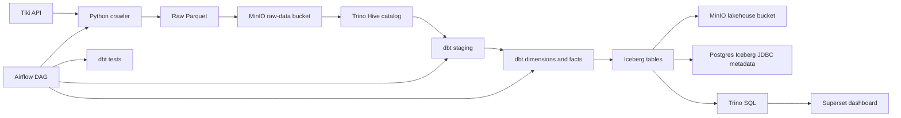
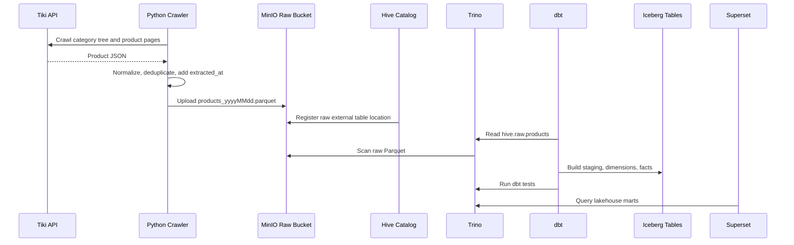
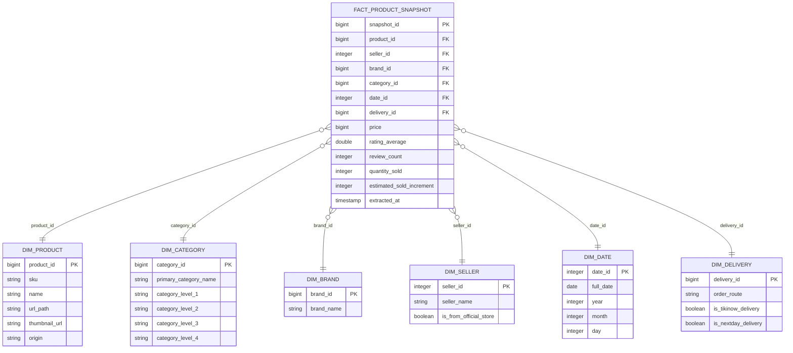

# Tiki Lakehouse Analytics Project

Du an xay dung pipeline du lieu end-to-end cho du lieu san pham Tiki. Pipeline crawl du lieu san pham hang ngay, luu raw data vao MinIO, expose raw Parquet bang Hive catalog, transform bang dbt qua Trino, luu bang phan tich vao Iceberg, dieu phoi bang Airflow va truc quan hoa bang Apache Superset.

Muc tieu chinh:

- Theo doi so luong ban uoc tinh theo ngay.
- Theo doi doanh thu uoc tinh theo ngay.
- Phan tich top san pham, brand, seller, category.
- Quan sat bien dong ban hang dua tren snapshot san pham hang ngay.
- Tao mot lakehouse local de hoc va demo Data Engineering.

## 1. Kien Truc Tong Quan



### Vai Tro Cac Thanh Phan

| Thanh phan | Vai tro trong he thong |
|---|---|
| Python crawler | Goi Tiki API, crawl san pham theo category, deduplicate va ghi Parquet |
| MinIO | Object storage S3-compatible, luu raw files va Iceberg data files |
| Hive catalog | Giup Trino doc folder raw Parquet nhu mot SQL table `hive.raw.products` |
| Trino | SQL query engine cho dbt va Superset |
| Iceberg | Table format cho staging, dimensions, facts trong lakehouse |
| Postgres | Luu metadata cho Superset va Iceberg JDBC catalog |
| dbt | Transform raw data thanh staging, dimensions va fact |
| Airflow | Orchestrate pipeline hang ngay va chay dbt tests |
| Superset | BI/dashboard layer query du lieu qua Trino |

Tom tat ngan gon:

```text
Hive = cua doc raw Parquet.
Iceberg = noi quan ly bang staging/dim/fact da transform.
Trino = engine chay SQL tren Hive va Iceberg.
MinIO = noi luu file vat ly.
```

## 2. Luong Du Lieu End-to-End



Chi tiet luong:

1. `crawler/fetch_tiki_8322.py` crawl san pham tu Tiki API.
2. Crawler ghi file:

```text
s3://raw-data/tiki_products/products_yyyyMMdd.parquet
```

3. Trino Hive catalog expose raw folder thanh table:

```text
hive.raw.products
```

4. dbt staging doc raw table:

```sql
FROM hive.raw.products
```

5. dbt ghi staging, dimensions va facts vao Iceberg:

```text
lakehouse.staging.stg_products
lakehouse.dimensions.*
lakehouse.facts.fact_product_snapshot
```

6. Superset query cac bang lakehouse qua Trino.

## 3. Docker Services

| Service | Container | URL/Port | Muc dich |
|---|---|---|---|
| MinIO | `tiki_minio` | http://localhost:9001 | Object storage UI |
| Trino | `tiki_trino` | http://localhost:8080 | SQL query engine |
| Airflow | `tiki_airflow_webserver` | http://localhost:8081 | Orchestration UI |
| Superset | `tiki_superset` | http://localhost:8088 | Dashboard UI |
| Postgres | `tiki_postgres` | localhost:5432 | Superset DB va Iceberg metadata |
| Postgres Airflow | `tiki_postgres_airflow` | localhost:5433 | Airflow metadata DB |

Timezone runtime duoc cau hinh la:

```text
Asia/Bangkok
```

Cac container Airflow va Trino duoc set `TZ=Asia/Bangkok`. Trino JVM cung duoc set:

```text
-Duser.timezone=Asia/Bangkok
```

## 4. Airflow DAG

DAG chinh:

```text
tiki_daily_pipeline
```

Lich chay:

```text
02:00 hang ngay theo Asia/Bangkok
```

Thu tu task hien tai:

```text
crawl_tiki_products
    -> dbt_run_marts
    -> dbt_test_marts
```

Y nghia:

| Task | Chuc nang |
|---|---|
| `crawl_tiki_products` | Crawl san pham Tiki va upload raw Parquet vao MinIO |
| `dbt_run_marts` | Build staging, dimensions va facts |
| `dbt_test_marts` | Chay dbt tests sau khi build xong |

`dbt_test_marts` giup pipeline fail som neu co loi chat luong du lieu nhu null key, duplicate key hoac relationship sai giua fact va dimension.

## 5. Data Model



### Grain Cua Fact

Bang `lakehouse.facts.fact_product_snapshot` co grain:

```text
1 dong = 1 san pham tai 1 ngay/thoi diem crawl
```

Khoa logic:

```text
snapshot_id = HASH(product_id || extracted_at)
```

### Metric Quan Trong

`quantity_sold` la so ban luy ke tai thoi diem crawl. Khong nen dung truc tiep lam daily sales.

`estimated_sold_increment` la so ban tang them so voi snapshot truoc cua cung san pham.

Metric dashboard nen dung:

```sql
SUM(estimated_sold_increment)
```

Doanh thu uoc tinh:

```sql
SUM(estimated_sold_increment * price)
```

Luu y DE quan trong: neu mot san pham bi miss crawl mot ngay roi xuat hien lai ngay sau, delta co the bi don vao ngay xuat hien lai. Vi vay dashboard nen co KPI coverage rate de biet ngay do crawl du hay thieu.

## 6. Superset Dashboard

File dashboard mau:

```text
superset_exports/tiki_dashboards.zip
```

Dashboard query 2 dataset chinh:

| Dataset | Nguon |
|---|---|
| `ds_daily_sales` | `lakehouse.facts.fact_product_snapshot` join voi dimensions |
| `ds_product_detail` | `lakehouse.facts.fact_product_snapshot` join voi product/brand/seller/category |

Chart mau:

| Chart | Metric chinh |
|---|---|
| Revenue and sales volume trend by day | `SUM(estimated_sold_increment)`, `SUM(revenue_estimate)` |
| Estimated revenue today | `SUM(estimated_sold_increment * price)` |
| Total sales volume today | `SUM(estimated_sold_increment)` |
| Top Products | units sold, revenue, weighted average price |
| Top 20 Brands | `SUM(revenue_estimate)` |
| Top 20 Sellers | `SUM(revenue_estimate)` |
| Tiki Verified % | revenue share by verified flag |
| Active product for sale | count products with positive increment |

Khuyen nghi them KPI data quality:

```sql
SELECT
    CAST(extracted_at AS DATE) AS full_date,
    COUNT(DISTINCT product_id) AS observed_products
FROM lakehouse.facts.fact_product_snapshot
GROUP BY 1
ORDER BY 1;
```

Neu co product universe:

```sql
coverage_rate = observed_products / total_products_in_universe
```

## 7. Ket Qua Thuc Thi Mau

Artifact dbt gan nhat trong repo cho thay lan `dbt run --target trino` da thanh cong:

```text
PASS=8 WARN=0 ERROR=0 SKIP=0 TOTAL=8
```

So dong ghi nhan trong lan chay mau:

| Model | Ket qua |
|---|---:|
| `stg_products` | 161,617 rows |
| `dim_product` | 161,617 rows |
| `dim_brand` | 23,618 rows |
| `dim_category` | 603 rows |
| `dim_seller` | 773 rows |
| `dim_delivery` | 33 rows |
| `dim_date` | 4,018 rows |
| `fact_product_snapshot` | 161,617 rows |

Thoi gian dbt run mau:

```text
Khoang 12.46 giay
```

Ket qua nay la artifact local tai thoi diem chay gan nhat, khong phai dam bao moi lan crawl deu co dung so dong tren. So dong phu thuoc vao Tiki API, category tree, timeout va coverage cua crawler.

## 8. Huong Dan Clone Va Chay Tu Dau

### Buoc 1: Clone repo

```powershell
git clone <repo-url>
cd tiki_project
```

### Buoc 2: Tao file `.env`

```powershell
Copy-Item .env.example .env
```

Mo `.env` va thay cac gia tri `change_me`.

Bien quan trong:

```text
TZ=Asia/Bangkok
MINIO_ROOT_USER
MINIO_ROOT_PASSWORD
POSTGRES_USER
POSTGRES_PASSWORD
SUPERSET_SECRET_KEY
AIRFLOW_FERNET_KEY
AIRFLOW_SECRET_KEY
TRINO_USER
```

### Buoc 3: Chay Docker Compose

```powershell
docker compose up -d
```

Kiem tra container:

```powershell
docker ps
```

Lan dau Airflow va Superset co the mat vai phut de cai package va migrate metadata DB.

### Buoc 4: Bootstrap Lakehouse Metadata

Chay mot lan sau khi stack da len:

```powershell
powershell -ExecutionPolicy Bypass -File scripts/bootstrap_lakehouse.ps1
```

Script nay se:

- Tao metadata table cho Iceberg JDBC catalog trong Postgres.
- Register raw table `hive.raw.products`.
- Tao Iceberg schemas:
  - `lakehouse.staging`
  - `lakehouse.dimensions`
  - `lakehouse.facts`

### Buoc 5: Trigger Airflow DAG

Mo Airflow:

```text
http://localhost:8081
```

Chon DAG:

```text
tiki_daily_pipeline
```

Trigger thu cong lan dau. Pipeline se chay:

```text
crawl_tiki_products -> dbt_run_marts -> dbt_test_marts
```

### Buoc 6: Mo Superset

Mo Superset:

```text
http://localhost:8088
```

Import dashboard mau:

```powershell
powershell -ExecutionPolicy Bypass -File scripts/import_superset_dashboard.ps1
```

Dashboard duoc import:

```text
Dashboard Tong quan Doanh thu & San pham Tiki
```

## 9. Chay Thu Cong Khong Qua Airflow

### Crawl raw data

```powershell
uv run python crawler/fetch_tiki_8322.py
```

### Chay dbt run

```powershell
cd dbt
uv run --env-file ../.env dbt run --target trino
```

### Chay dbt test

```powershell
cd dbt
uv run --env-file ../.env dbt test --target trino
```

### Kiem tra dbt connection

```powershell
cd dbt
uv run --env-file ../.env dbt debug --target trino
```

## 10. Truy Van Mau

### Doanh thu va so ban theo ngay

```sql
SELECT
    d.full_date,
    SUM(f.estimated_sold_increment) AS daily_units_sold,
    SUM(f.estimated_sold_increment * f.price) AS estimated_daily_revenue
FROM lakehouse.facts.fact_product_snapshot f
LEFT JOIN lakehouse.dimensions.dim_date d
    ON f.date_id = d.date_id
GROUP BY d.full_date
ORDER BY d.full_date;
```

### Top san pham ban tang them nhieu nhat

```sql
SELECT
    d.full_date,
    p.product_id,
    p.name AS product_name,
    SUM(f.estimated_sold_increment) AS daily_units_sold,
    SUM(f.estimated_sold_increment * f.price) AS estimated_revenue
FROM lakehouse.facts.fact_product_snapshot f
LEFT JOIN lakehouse.dimensions.dim_date d
    ON f.date_id = d.date_id
LEFT JOIN lakehouse.dimensions.dim_product p
    ON f.product_id = p.product_id
GROUP BY
    d.full_date,
    p.product_id,
    p.name
ORDER BY daily_units_sold DESC
LIMIT 20;
```

### Coverage theo ngay

```sql
SELECT
    CAST(extracted_at AS DATE) AS full_date,
    COUNT(DISTINCT product_id) AS observed_products
FROM lakehouse.facts.fact_product_snapshot
GROUP BY 1
ORDER BY 1;
```

## 11. Van De Data Quality Can Biet

### 11.1. Miss Crawl Product

Crawler co the khong lay du 100% product moi ngay vi:

- Tiki API timeout.
- Category pagination thay doi.
- San pham bien mat khoi listing.
- Request bi rate limit.
- Category tree thay doi.

Fact hien tai chi co san pham crawl duoc trong ngay. Neu product bi miss mot ngay, ngay do se khong co dong fact cho product do. Khi product xuat hien lai, delta co the bi don vao ngay xuat hien lai.

Khuyen nghi nang cap:

- Tao `fact_product_daily` co grain `product_id x date`.
- Them cot `is_observed`.
- Them `last_seen_date`, `days_since_last_seen`.
- Khong tinh daily delta khi snapshot truoc khong phai ngay lien truoc.
- Them dashboard coverage rate.

### 11.2. Rerun Cung Ngay

Fact hien dang duoc materialize incremental. Neu rerun cung ngay, can can than duplicate snapshot neu chien luoc append duoc dung. Nen uu tien chuyen fact sang merge hoac them logic idempotent theo `snapshot_id`.

### 11.3. Timezone

Pipeline da set timezone `Asia/Bangkok` cho Airflow va Trino. Crawler tao file theo ngay local cua container, nen viec set `TZ` giup ten file `products_yyyyMMdd.parquet` khop ngay business Vietnam hon.

## 12. Loi Hay Gap

### MinIO bi xoa file nhung Iceberg metadata con tro file cu

Xu ly:

```powershell
powershell -ExecutionPolicy Bypass -File scripts/reset_lakehouse_metadata.ps1 -Force
```

Sau do trigger lai DAG.

### Airflow khong thay DAG

Kiem tra:

```powershell
docker exec tiki_airflow_scheduler airflow dags list
```

Restart Airflow:

```powershell
docker compose up -d airflow-webserver airflow-scheduler
```

### Superset filter hien `<NULL>`

Kiem tra dataset va native filter target. Voi Superset version hien tai, native filter nen dung:

```text
datasetId
```

Sau khi sua dashboard metadata, thu:

```text
Ctrl + F5
```

hoac logout/login lai Superset.

### dbt staging khong doc dung raw file

`stg_products.sql` doc raw file theo ngay hien tai:

```sql
WHERE "$path" LIKE '%' || FORMAT_DATETIME(CURRENT_TIMESTAMP, 'yyyyMMdd') || '%'
```

Vi vay raw file tren MinIO can co ten:

```text
products_yyyyMMdd.parquet
```

## 13. Prompt Tao Anh Kien Truc Bang ChatGPT

Ban co the dua cac prompt sau cho ChatGPT hoac cong cu tao anh de tao minh hoa sinh dong cho README, slide hoac bao cao.

### Anh 1: Lakehouse Architecture

```text
Create a clean modern data engineering architecture diagram for a Tiki product analytics lakehouse. Show Tiki API on the left, Python Crawler, MinIO raw-data bucket storing Parquet files, Trino with Hive catalog reading raw Parquet, dbt transforming staging/dimensions/facts, Iceberg tables stored in MinIO lakehouse bucket with Postgres JDBC metadata, Airflow orchestrating crawler/dbt/dbt tests, and Superset dashboard on the right. Use a professional blue and green technical style, clear arrows, readable labels, no clutter, 16:9 aspect ratio.
```

### Anh 2: Data Flow Story

```text
Create an illustrated data flow for an ecommerce analytics pipeline. Step 1 crawl products from Tiki API, step 2 save daily Parquet snapshot to MinIO, step 3 query raw files via Trino Hive catalog, step 4 transform with dbt into staging dimensions and fact tables, step 5 store curated tables as Apache Iceberg, step 6 visualize revenue and sales metrics in Apache Superset. Use numbered steps, friendly but technical style, 16:9 aspect ratio, high readability.
```

### Anh 3: Star Schema

```text
Create a star schema diagram for Tiki product analytics. Put fact_product_snapshot in the center with columns snapshot_id, product_id, seller_id, brand_id, category_id, date_id, delivery_id, price, quantity_sold, estimated_sold_increment. Surround it with dim_product, dim_category, dim_brand, dim_seller, dim_date, dim_delivery. Use database table cards, primary and foreign key markers, clean white background, 16:9 aspect ratio.
```

### Anh 4: Data Quality Coverage

```text
Create a data quality dashboard illustration for a daily ecommerce crawler. Show observed products, expected product universe, coverage rate, missing products, and a warning that missing crawl data can distort daily revenue and sales. Include a small line chart showing coverage by day and a note: "Do not treat missing product as zero sales". Professional analytics style, 16:9 aspect ratio.
```

## 14. Nen Commit Va Khong Nen Commit

Nen commit:

```text
.env.example
README.md
docker-compose.yml
crawler/
dbt/
dags/
scripts/
trino/
pyproject.toml
uv.lock
superset_exports/
```

Khong nen commit:

```text
.env
.venv/
logs/
preview_data/
dbt/target/
dbt/logs/
dbt/*.duckdb
dbt/*.parquet
tiki_lakehouse.egg-info/
```

## 15. Huong Phat Trien Tiep

- Tao `fact_product_daily` de xu ly product bi miss crawl.
- Them KPI coverage rate vao Superset.
- Chuyen fact sang incremental merge de rerun idempotent.
- Them crawl audit table theo category/page/status.
- Build custom Airflow image de khong cai dependencies luc container start.
- Tach credential khoi Trino catalog properties de tranh hard-code secret.
- Them alert khi coverage thap hoac doanh thu giam bat thuong.
